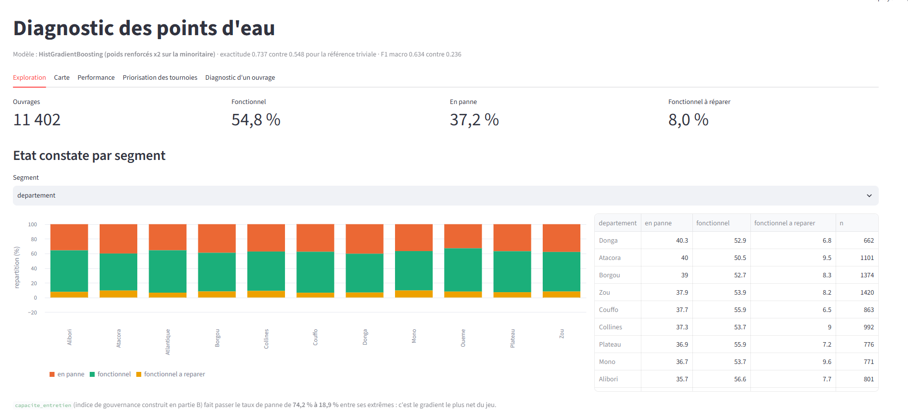

# Diagnostic de l'état des points d'eau

Modèle de classification multi-classes prédisant l'état de fonctionnement d'un point
d'eau à partir de son inventaire, livré avec un tableau de bord Streamlit qui produit
des listes de tournées de maintenance priorisées.

**TP 3  classification multi-classes déséquilibrée · eau et infrastructures publiques**

---

## 1. Le problème

Un service national de l'eau dispose de l'inventaire de **11 472 points d'eau** relevés
en 2025 : forages, puits modernes, adductions villageoises. Envoyer une équipe technique
inspecter un ouvrage coûte cher.

**Objectif :** prédire l'état d'un ouvrage à partir des données d'inventaire pour
**prioriser les tournées de maintenance** sans avoir à tout inspecter.

| Classe | Part | Enjeu opérationnel |
|---|---|---|
| `fonctionnel` | 54,8 % | rien à faire |
| `en panne` | 37,2 % | réhabilitation lourde, coûteuse |
| **`fonctionnel a reparer`** | **8,0 %** | **une intervention légère évite la panne totale** |

C'est la classe minoritaire qui porte la valeur : détecter un ouvrage encore rattrapable
évite une réhabilitation complète. C'est aussi la plus difficile à prédire.

> Les données sont **synthétiques**. La structure s'inspire des inventaires nationaux ;
> les noms de communes sont réels mais les coordonnées sont des tirages aléatoires.

---

## 2. Les données

`data/points_eau.csv`  11 472 lignes × 32 colonnes.

| Bloc | Colonnes |
|---|---|
| Localisation | `id_point_eau`, `date_releve`, `departement`, `commune`, `latitude`, `longitude`, `altitude_m` |
| Ouvrage | `annee_construction`, `type_ouvrage`, `type_pompe`, `profondeur_forage_m`, `niveau_statique_m`, `debit_essai_m3_h`, `qualite_eau` |
| Desserte | `nb_menages`, `population_desservie`, `distance_village_m`, `nb_points_eau_village` |
| Gouvernance | `mode_gestion`, `mode_paiement`, `cotisation_mensuelle_fcfa`, `maitre_ouvrage`, `installateur` |
| Appui technique | `technicien_forme_village`, `stock_pieces_rechange_commune`, `distance_atelier_km` |
| Historique | `nb_pannes_12_mois`, `mois_depuis_derniere_maintenance` |
|  Post-constat (fuite) | `nb_jours_arret_12_mois`, `intervention_prevue`, `cout_reparation_estime_fcfa` |
|  Cible | `etat_fonctionnement` |

### Anomalies traitées

| Anomalie | Volume                    | Traitement |
|---|---------------------------|---|
| Doublons exacts | **70** (et non 65)        | suppression après normalisation des dates |
| Sentinelles `latitude`/`longitude = 0.0` | 214                       |  `NaN` |
| Sentinelles `annee_construction = 0` | 168                       |  `NaN` |
| Sentinelles `population_desservie = 0` | 95                        |  `NaN` |
| Sentinelles `debit_essai_m3_h = -1` | 64                        |  `NaN` |
| Profondeurs saisies en centimètres | 104                       | division par 100 |
| `niveau_statique > profondeur_forage` | 78                        | niveau → `NaN` |
| Libellés hétérogènes | `type_pompe` 10 -> 8      | `strip` + NFKD + `capitalize` |
| Valeurs manquantes | 7 colonnes, jusqu'à 14,6 % | imputation **dans le pipeline** |

**11 472 - > 11 402 ouvrages.**

### Trois trouvailles méthodologiques

**1. 70 doublons et non 65.** Sept `id_point_eau` restaient répétés après le
dédoublonnage ; ils ne différaient que par `date_releve`, écrite dans les deux formats
(`22/01/2025` et `2025-01-22` la même date). `duplicated()` compare des chaînes de
caractères. **La normalisation des formats doit précéder la détection des doublons.**

**2. Le seuil de A4 est justifié par un vide, pas choisi arbitrairement.** Les
profondeurs suspectes vont de 220 à 11 050, les normales de 5 à 99,9. Le nombre de lignes
au-delà de 200 est identique à celui au-delà de 300 (**106**) : aucune valeur légitime
n'existe entre les deux. Un seuil à 100 aurait converti 461 lignes et créé
**294 fausses incohérences** en A5.

**3. Les valeurs manquantes ne sont pas informatives.** Six indicateurs binaires testés
(A7), aucun significatif, une probabilité p de 0,11 à 0,51. L'hypothèse de l'énoncé (« un ouvrage dont
personne n'a relevé les coordonnées est un ouvrage que personne ne suit ») **n'est pas
vérifiée**. Variables conservées, apport mesuré par ablation en partie C.

---

## 3. Démarche

### La fuite de données

Trois colonnes sont renseignées **après le constat d'état** :

| Colonne | Preuve                                                                                                                                         |
|---|------------------------------------------------------------------------------------------------------------------------------------------------|
| `intervention_prevue` | correspondance **parfaite** : `Aucune` => 100 % fonctionnel, `Rehabilitation lourde` => 100 % en panne, `Reparation legere` => 100 % à réparer |
| `nb_jours_arret_12_mois` | 176 jours contre 3,6 selon la classe, un ouvrage est arrêté 176 jours par an *est* en panne                                                    |
| `cout_reparation_estime_fcfa` | un devis suppose le diagnostic déjà fait                                                                                                       |

**Expérience demandée** (`reports/experience_fuite.csv`) :

| Configuration | Exactitude | F1 macro |
|---|---|---|
| **AVEC** les colonnes post-constat | **1,0000** | **1,0000** |
| **SANS** (modèle retenu) | 0,7374 | 0,6343 |

**Le faux ami.** `nb_pannes_12_mois` n'est **pas** une fuite : c'est un historique de
maintenance connu avant l'inspection. Les chiffres le confirment — 1,87 panne pour les
ouvrages en panne contre 1,95 pour les rattrapables, soit **4 % d'écart**. Une fuite ne
ressemble pas à ça. Variable conservée, et elle arrive 3ᵉ en importance.

### Ce qui détermine l'état d'un point d'eau

L'analyse exploratoire converge vers une conclusion nette : **ce n'est ni la technique,
ni la géographie, c'est la gouvernance.**

| Facteur | Force du lien (V de Cramér) |
|---|---|
| `mode_gestion` | **0,202** |
| `mode_paiement` | 0,196 |
| `installateur` | 0,148 |
| `type_pompe` | 0,128 |
| `commune` | 0,090 |
| `departement` | 0,042 |

**La géographie ne dit rien.** L'écart-type des taux de panne entre les 76 communes vaut
**4,59 points** ; en permutant aléatoirement la cible, on obtient **4,01 ± 0,32**. L'écart
observé est à **+1,79 écart-type** : compatible avec le hasard. Avec ~150 ouvrages par
commune, un taux oscillant entre 26 % et 50 % est du bruit d'échantillonnage.

**L'installateur, lui, compte massivement.** Écart-type observé **7,01** contre
**3,29 ± 0,32** au hasard, soit **+11,6 écarts-types**. Le taux de panne va de 21,4 %
(`Ent-009`) à 53,3 % (`Ent-042`) avec un facteur 2,5, et les intervalles de confiance de
Wilson ne se recouvrent pas. Vingt entreprises sur 52 s'écartent significativement de la
moyenne nationale.

*Le piège des faibles effectifs annoncé par l'énoncé ne se matérialise pas : les
52 entreprises comptent entre 186 et 251 ouvrages, aucune sous 50.*

### L'exercice central (B4) : ce qui sépare les deux classes dégradées

Les variables **techniques** ne les séparent pas :

| Variable | en panne | à réparer | Écart |
|---|---|---|---|
| `age_ans` | 26,1 ans | 28,3 ans | +8 % |
| `qualite_eau` (potable) | 58,6 % | 58,8 % | +0,3 % |
| `nb_pannes_12_mois` | 1,87 | 1,95 | +4 % |

Les variables de **gouvernance**, si :

| Variable | en panne | à réparer | Écart |
|---|---|---|---|
| `mois_depuis_derniere_maintenance` | **25,8 mois** | **12,0 mois** | **−53,6 %** |
| `cotisation_mensuelle_fcfa` | 301 FCFA | 439 FCFA | **+45,6 %** |
| Délégataire privé | 10,8 % | 20,9 % | ×1,9 |
| Aucune gestion formelle | 29,5 % | 18,7 % | ×0,6 |
| Paiement gratuit | 40,8 % | 27,2 % | ×0,7 |

**Un ouvrage dégradé qui reste réparable est un ouvrage encore suivi** : entretenu dans
l'année, financé par une cotisation, confié à un gestionnaire identifié. Celui qui bascule
en panne totale est celui qu'on a laissé sans maintenance depuis plus de deux ans, sans
recette et sans responsable.

C'est une bonne nouvelle opérationnelle : la classe minoritaire se repère sur des
variables **administratives**, disponibles sans inspection.

### `capacite_entretien`  la variable construite sur ce constat

Indice de 0 à 4 : maintenance récente (≤ 18 mois) + cotisation perçue + gestionnaire
identifié + paiement non gratuit.

| Indice | en panne | fonctionnel | à réparer | n |
|---|---|---|---|---|
| 0 | **74,2 %** | 22,5 % | 3,3 % | 854 |
| 1 | 56,2 % | 35,1 % | 8,7 % | 1 455 |
| 2 | 41,2 % | 48,1 % | 10,7 % | 1 056 |
| 3 | 41,7 % | 52,9 % | 5,4 % | 3 643 |
| 4 | **18,9 %** | 70,9 % | 10,2 % | 4 394 |

**Le taux de panne passe de 74,2 % à 18,9 %** — le gradient le plus net du jeu.

---

## 4. Résultats

### C2  encodage à haute cardinalité (`reports/c2_encodages.csv`)

`commune` (76 modalités) et `installateur` (52), à modèle égal :

| Stratégie | CV F1 macro | Test | Colonnes | F1 « à réparer » |
|---|---|---|---|---|
| Target encoding (CV interne) | **0,6283** | 0,6291 | 80 | 0,3642 |
| One-hot brut | 0,6213 | **0,6388** | 202 | 0,3738 |
| Regroupement des rares (<1 %) | 0,6189 | 0,6367 | 201 | **0,3913** |
| Encodage par fréquence | 0,6102 | 0,6159 | 76 | 0,3312 |
| Exclusion | 0,6059 | 0,6369 | **74** | 0,3810 |

**Aucune stratégie ne se détache** : 0,022 d'écart pour un écart-type de 0,013. Le
classement **s'inverse sur la classe minoritaire**.  

Le regroupement des rares est d'ailleurs **inopérant ici** (201 colonnes contre 202) :
aucune modalité n'est rare.

### C3  département et commune

| Configuration | CV F1 macro | Test | F1 « à réparer » | Colonnes |
|---|---|---|---|---|
| **Toutes les variables** | 0,6213 | **0,6388** | **0,3738** | 202 |
| Sans commune | **0,6255** | 0,6204 | 0,3344 | 126 |
| Sans commune + département | 0,6178 | 0,6271 | 0,3556 | 115 |
| Sans installateur | 0,6037 | 0,6271 | 0,3697 | 150 |
| Sans les trois | 0,6026 | 0,6057 | 0,3208 | 63 |

**Un piège méthodologique, et je suis tombé dedans.** Évaluées séparément, chacune de ces
variables paraissait dispensable. J'ai donc conclu qu'on pouvait les retirer toutes  
avant de mesurer. Leur retrait conjoint coûte **0,033 en test**, deux écarts-types et
demi, et fait chuter le F1 de la classe minoritaire de **0,3738 à 0,3208 (−14 %)**.

**Une ablation variable par variable ne prédit pas l'effet d'une ablation groupée.** Quand
des variables portent une information partiellement redondante *entre elles*, retirer la
première ne coûte rien parce que les autres compensent; les retirer toutes fait tomber
le signal. C'est pour cela que `configuration_finale()` mesure au lieu de supposer.

**Décision : on garde tout.** Aucun retrait n'améliore la classe minoritaire.

### D2/D4/D6  comparaison des modèles

| Modèle | CV F1 macro (5 blocs) | Exactitude | Test F1 macro | F1 « à réparer » |
|---|---|---|---|---|
| Forêt aléatoire | **0,6291 ± 0,0121** | 0,7133 | 0,6201 | 0,3735 |
| HistGradientBoosting | 0,6213 ± 0,0121 | **0,7475** | **0,6388** | 0,3738 |
| Régression logistique | 0,6182 ± 0,0108 | 0,6957 | 0,6220 | **0,3866** |
| **Référence triviale** | **0,2361** | 0,5484 | 0,2361 | 0,0000 |

**2,7 fois mieux que la référence triviale** en F1 macro.

### D5  traitement du déséquilibre, effet **par classe**

| Approche | CV F1 macro | Exactitude | F1 « à réparer » | **Rappel « à réparer »** |
|---|---|---|---|---|
| Sur-échantillonnage aléatoire | **0,6263** | 0,7396 | 0,3522 | 0,3077 |
| **Poids manuels (×2 minoritaire)** | 0,6226 | 0,7374 | **0,3785** | **0,3681** |
| `class_weight="balanced"` | 0,6213 | **0,7475** | 0,3738 | 0,3297 |
| SMOTE | 0,6200 | 0,7492 | 0,3026 | 0,2253 |
| Aucun traitement | 0,6010 | **0,7505** | 0,2980 | 0,2088 |

**L'exactitude va à l'inverse du F1 macro.** « Aucun traitement » obtient la **meilleure
exactitude** (0,7505) et le **pire F1 macro** (0,6119) : il gagne en abandonnant la classe
minoritaire, dont il ne détecte qu'**un cinquième** (rappel 0,2088).

**Approche retenue : les poids manuels ×2.** Le rappel sur la classe rattrapable passe de
0,2088 à **0,3681,  +76 %**  pour **1,3 point d'exactitude**. Sur un outil de
priorisation de tournées, détecter deux fois plus d'ouvrages rattrapables prime.

**SMOTE est le pire des traitements actifs.** Il interpole entre voisins ; sur des
variables largement catégorielles et binaires, il fabrique des ouvrages qui n'existent pas.

### D7 réglage des hyperparamètres

Grille sur `HistGradientBoostingClassifier`, 25 tirages parmi 324 combinaisons,
scoring `f1_macro` : `max_iter` ∈ {200, 400, 600} · `learning_rate` ∈ {0,03 ; 0,05 ; 0,1} ·
`max_depth` ∈ {None, 4, 6, 8} · `min_samples_leaf` ∈ {10, 20, 40} ·
`l2_regularization` ∈ {0 ; 0,1 ; 1,0}. 

Meilleure combinaison : `max_iter=200, max_depth=None, learning_rate=0.03,
min_samples_leaf=10, l2_regularization=0.1` => **CV 0,6388, test 0,6408**, et
**F1 « à réparer » = 0,3991** :  le meilleur obtenu toutes approches confondues.

Contrairement au réglage d'un modèle déjà bien spécifié, il apporte ici **+0,0175 en CV**,
au-dessus de l'écart-type (0,012).

### D8  approche ordinale en cascade

Les trois classes sont ordonnées. Deux classifieurs binaires en cascade : d'abord
dégradé / fonctionnel, puis en panne / à réparer parmi les dégradés.

| Approche | Exactitude | F1 macro | F1 « à réparer » |
|---|---|---|---|
| Cascade ordinale | 0,7484 | 0,6344 | 0,3630 |
| **Multi-classes direct** | 0,7475 | **0,6388** | **0,3738** |

**Elle ne fait pas mieux**, alors que l'intuition était bonne : à l'étage 2, la classe
minoritaire pèse **17,7 % au lieu de 8,0 %**. Mais la cascade **propage ses erreurs** —
un ouvrage classé « fonctionnel » à l'étage 1 ne peut plus être rattrapé, et le gain de
l'étage 2 est annulé par les pertes de l'étage 1.

### E1/E2  le modèle retenu

```
                       precision  recall  f1-score  support
en panne                  0,727    0,739    0,733      848
fonctionnel               0,793    0,790    0,791    1 251
fonctionnel a reparer     0,390    0,368    0,379      182

exactitude                                  0,737    2 281
F1 macro                  0,636    0,632    0,634
F1 pondéré                0,736    0,737    0,737
exactitude équilibrée                       0,632
```

**Ce que chaque agrégat cache :**

- **exactitude 0,737**  flattée par la classe majoritaire ; la référence triviale en
  obtient déjà 0,548 sans rien prédire ;
- **F1 pondéré 0,737**  pondère par les effectifs, donc dominé lui aussi par les 54,8 % ;
- **F1 macro 0,634**  traite les trois classes à égalité, sanctionne l'abandon de la
  minoritaire. **C'est la métrique de sélection retenue** ;
- **exactitude équilibrée 0,632**  moyenne des rappels ; utile, mais ignore la précision,
  donc aveugle au coût des visites inutiles.

**E3  le meilleur modèle en exactitude n'est pas le meilleur en F1 macro.** Sur ce jeu,
« aucun traitement du déséquilibre » domine en exactitude (0,7505) et arrive dernier en
F1 macro (0,6119). Nous retenons le F1 macro **et le rappel de la classe minoritaire**,
parce que l'objectif métier n'est pas de bien classer le parc dans son ensemble mais de
**trouver les ouvrages rattrapables**.

### E1  la confusion la plus coûteuse

```
                       predit en panne  fonctionnel  a reparer
reel en panne                    627        179          42
reel fonctionnel                 200        988          63
reel 'a reparer'                  36         79          67
```

La plus **fréquente** : 200 ouvrages fonctionnels prédits en panne (16 % de la classe) 


La plus **coûteuse** : **115 ouvrages rattrapables non détectés sur 182, soit 63,2 %**.
Chacun bascule en panne totale faute d'intervention légère. Et **79 d'entre eux sont
prédits « fonctionnel »**  donc jamais visités.

### E5 . importance par permutation (scoring `f1_macro`)

| Rang | Variable | Chute du F1 macro |
|---|---|---|
| 1 | `appui_technique` | **0,0591 ± 0,0088** |
| 2 | `annee_construction` | 0,0583 ± 0,0096 |
| 3 | `nb_pannes_12_mois` | 0,0422 ± 0,0057 |
| 4 | `technicien_forme_village` | 0,0262 ± 0,0027 |
| 5 | `mois_depuis_derniere_maintenance` | 0,0240 ± 0,0079 |
| 6 | `installateur` | 0,0220 ± 0,0055 |
| 7 | `mode_gestion` | 0,0156 ± 0,0034 |

**Quatre des sept premières sont des variables de gouvernance**  l'analyse exploratoire
est confirmée par le modèle. `installateur` arrive 6ᵉ, ce qui valide sa conservation.

 `capacite_entretien` n'arrive qu'au 13ᵉ rang : ses ingrédients sont déjà dans le modèle
séparément. **La permutation sous-estime les variables redondantes**, permuter l'une
laisse les autres disponibles.

### E6 exploitation opérationnelle : **le chiffre qui compte**

Le service peut inspecter 500 points d'eau. La liste est établie par probabilité
décroissante d'être `fonctionnel a reparer`.

| Budget | Détectés | Au hasard | **Gain** | Précision | Couverture de la classe |
|---|---|---|---|---|---|
| 100 | 47 | 8,0 | **×5,89** | 47,0 % | 25,8 % |
| 250 | 87 | 19,9 | ×4,36 | 34,8 % | 47,8 % |
| **500** | **119** | **39,9** | **×2,98** | 23,8 % | **65,4 %** |
| 1 000 | 163 | 79,8 | ×2,04 | 16,3 % | 89,6 % |

**Avec 500 inspections, le service trouve 119 ouvrages rattrapables au lieu de 40 trois fois plus et couvre 65 % de tous les ouvrages rattrapables du parc.** Sur les
100 premières inspections, le gain atteint ×5,9.
 

### E7  équité géographique : **un problème réel**

| Département | n | Manquants | F1 macro | F1 « à réparer » |
|---|---|---|---|---|
| Plateau | 140 | **2,11 %** | **0,5706** | **0,2353** |
| Borgou | 262 | 2,03 % | 0,5977 | 0,3000 |
| Atlantique | 272 | 1,99 % | 0,5977 | 0,2500 |
| … | | | | |
| Alibori | 175 | 1,71 % | 0,6568 | 0,4444 |
| Atacora | 213 | **1,53 %** | **0,6685** | 0,3889 |

**Corrélation entre taux de données manquantes et F1 macro : −0,610.**

**Le modèle sous-performe précisément là où les données sont les plus incomplètes.** Le
F1 sur la classe minoritaire varie de **0,2353 à 0,4737 , un facteur 2** selon le
département.

---

## 5. Capture d'écran



 
---

## 6. Installation et lancement

```bash
git clone <url-du-depot>
cd points_eau

python -m venv venv
venv\Scripts\activate          # Windows
# source venv/bin/activate     # Linux / macOS

pip install -r requirements.txt
```

```bash
cd src
python train.py       # C2, C3, fuite, D1 a D8, serialisation  (~45 min, D7 est long)
python evaluate.py    # E1 a E7 : confusion, courbes, priorisation, equite

cd ..
streamlit run app/streamlit_app.py
```

`train.py` produit `models/pipeline_points_eau.joblib` indispensable au lancement de
l'application.

Le notebook `notebooks/note.ipynb` couvre les parties A à C1 : **Kernel => Restart & Run All**.

### Arborescence

```
points_eau/
├── data/points_eau.csv               # jeu brut (versionne : reproductibilite)
├── notebooks/note.ipynb              # parties A a C1 : audit, EDA, variables derivees
├── src/
│   ├── preprocessing.py              # nettoyage + variables derivees (module unique)
│   ├── train.py                      # C2, C3, fuite, D1 a D8, serialisation
│   └── evaluate.py                   # E1 a E7 : diagnostic et priorisation
├── app/streamlit_app.py              # tableau de bord du service technique
├── models/pipeline_points_eau.joblib # pipeline entraine + metadonnees
├── reports/                          # figures et tableaux de resultats
├── requirements.txt
└── README.md
```

**Un seul module de préparation.** `src/preprocessing.py` est importé par le notebook,
par `train.py`, par `evaluate.py` et par l'application. Les variables dérivées ne peuvent
donc pas diverger entre l'entraînement et la prédiction.

**Reproductibilité.** `random_state=42` est fixé dans les découpes, les modèles, la
validation croisée, les rééchantillonnages et les recherches d'hyperparamètres.

---
 
## Auteur

**Josse Perrin FANOU** - Ingénieur Logiciel & Data Science

perrinfanou6@gmail.com

+229 0162099124
